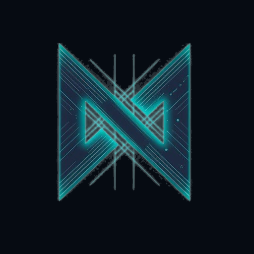

# NexonVPN — Android

Нативный Android-клиент для VPN-сервиса на **3x-ui / Remnawave** (VLESS/Reality,
Xray-core). Приложение **автономно**: при первом запуске само регистрирует
устройство и получает пробную подписку — без Telegram-бота и сайта.

<p align="center"></p>

---

## Как это работает

```
Первый запуск
  → генерируем HWID устройства (SHA-256 от seed, хранится в DataStore)
  → POST {BASE_URL}/api/app/register  (заголовок X-HWID)
        сервер: add_user(synthetic_id) + grant_subscription(trial) → uuid
  → сохраняем uuid
  → GET {BASE_URL}/api/sub/{uuid}   (Remnawave-JSON: серверы + статус подписки)
  → парсим vless:// / ss:// / trojan:// → конфиг Xray
  → VpnService (TUN) → tun2socks → socks → Xray-core → сервер
```

Идентификация полностью по устройству (HWID). Тот же HWID уходит в заголовках
`X-HWID` / `X-Forwarded-Device-*`, поэтому работает и серверный лимит устройств.

## Структура

| Путь | Назначение |
|------|-----------|
| `app/src/main/java/.../data` | HWID, DataStore, сетевой клиент (`ApiService`), репозиторий |
| `app/src/main/java/.../core` | Парсер ссылок (`ProxyLink`) и сборка конфига Xray (`XrayConfig`) |
| `app/src/main/java/.../vpn` | `VpnController`, `V2RayVpnService` (TUN + ядро + tun2socks) |
| `app/src/main/java/.../ui` | Экран (Jetpack Compose) и брендовый логотип |
| `app/src/stub/java/libv2ray` | Заглушка ядра (флейвор `stub`) |
| `backend/app_register.py` | **Серверный** эндпоинт автономной регистрации |

## Сборка

Проект в подпапке `android/`. Флейворы ядра:

- **stub** — заглушка `libv2ray`, APK собирается всегда (для проверки UI/логики,
  туннель не поднимается):
  ```bash
  cd android && ./gradlew assembleStubDebug
  ```
- **full** — реальное ядро Xray. Нужен `app/libs/libv2ray.aar` из
  [AndroidLibXrayLite](https://github.com/2dust/AndroidLibXrayLite) (`gomobile bind`).
  Актуальный core принимает TUN fd напрямую (`CoreController.startLoop(config, tunFd)`)
  и мостит трафик внутри — отдельный tun2socks не нужен. AAR собирает CI
  (`.github/workflows/android.yml`, job `build-full`).

CI (`Android (NexonVPN)`) на каждый пуш собирает stub-APK и, best-effort, full-APK.

## Настройка перед релизом

1. **Домен сервера** — `local.properties`:
   ```properties
   nexon.baseUrl=https://vpn.вашдомен.com
   ```
   (или env `NEXON_BASE_URL` в CI). Это ваш `sub_page_url` из админки.

2. **Бэкенд** — добавьте два публичных роутера. В `xuiweb/run.py`:
   ```python
   from app_register import router as app_register_router
   from app_payments import router as app_payments_router
   app.include_router(app_register_router)
   app.include_router(app_payments_router)
   ```
   - `backend/app_register.py` — регистрация: создаёт таблицу `app_devices`
     (idempotent hwid→user) и выдаёт триал через вашу `grant_subscription`.
     Параметры триала из настроек (`trial_days`, `trial_limit_ip`). Опционально —
     защита заголовком `X-App-Token` (env `APP_REGISTER_TOKEN`).
   - `backend/app_payments.py` — тарифы и оплата: `GET /api/app/tariffs` и
     `POST /api/app/purchase` (методы yookassa/platega/yoomoney/wata). Повторяет
     платёжный флоу сайта, зачисление делает штатный вебхук провайдера
     (`process_successful_payment` по `user_id`). Требует, чтобы `db_helpers` и
     `src.pay` были импортируемы, а провайдеры были настроены в админке.

3. **Подпись** — `keystore.properties` (`storeFile/storePassword/keyAlias/keyPassword`)
   для release-сборки. В CI — через secrets.

## Брендинг

- Название: **NexonVPN**, слоган «Защита и свобода в сети».
- Палитра: фон `#060B12`, неоновый акцент `#24E5C6` (см. `ui/theme/Theme.kt`).
- Логотип — векторный (Compose `Canvas` + `ic_launcher_foreground.xml`), исходник
  заставки в `branding/logo_source.png`.
- URL-scheme импорта: `nexon://add/<sub_url>` (совместим с `ADD_LINK` на бэкенде).

## Статус и что дальше

Готово: автономная регистрация, загрузка подписки, парсинг серверов, UI, туннель
(Xray-core, актуальный `CoreController` API — TUN fd напрямую в ядро), **экран
тарифов и оплата** (yookassa/platega/yoomoney/wata через существующий бэкенд).
**Требует проверки на реальном устройстве** после сборки `full`. Дальше: пуш об
окончании подписки, авто-переподключение, split-tunneling (per-app), оплата
криптой (USDT через cryptobot — нужен shared-creator в бэкенде).
